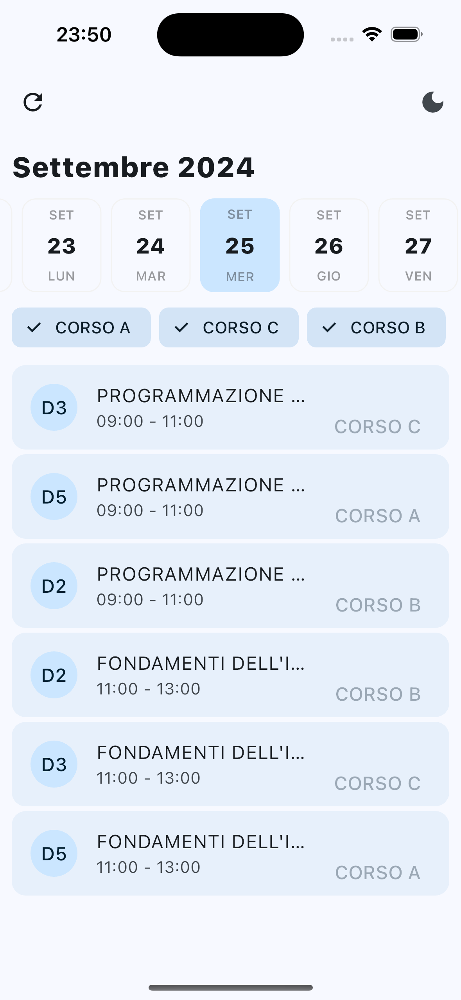
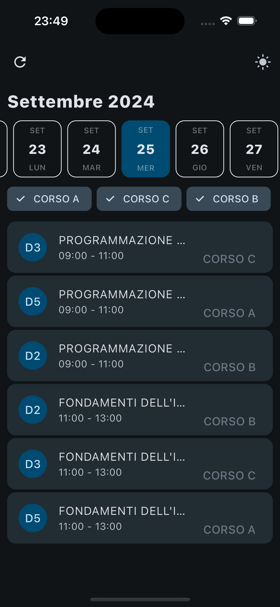
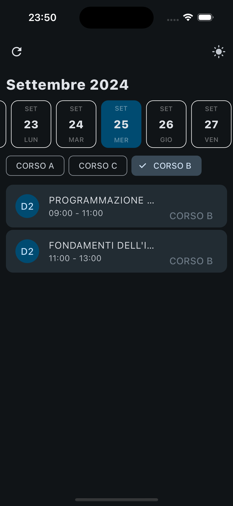
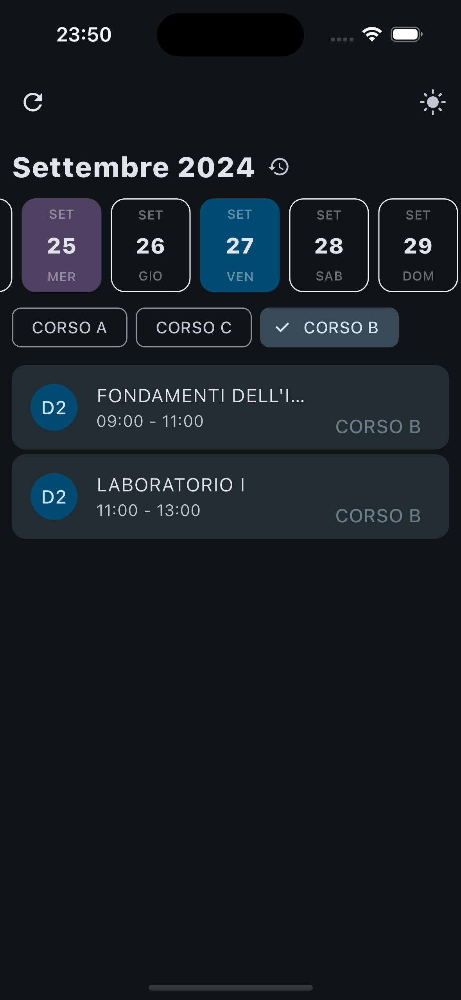
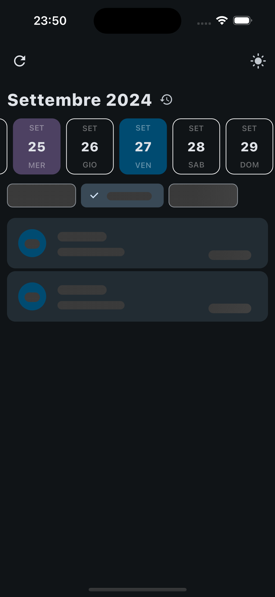
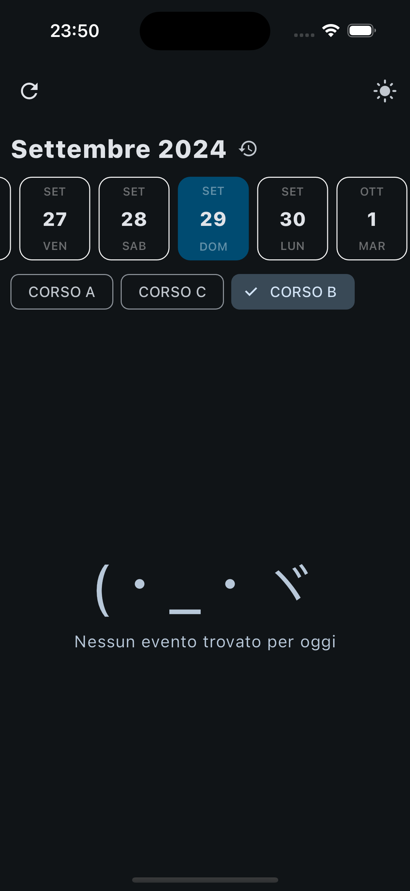

# UniPi Orario


made with ❤️ by [ale](https://github.com/aleeeee1) and [zubby](https://github.com/zubbyy)

<br />

UniPi Orario allows you to visualize your (maybe!) university timetable in a more intuitive way. \
It is designed to be simple and easy to use, with a clean and modern interface, built with Material You design in mind.

# Screenshots

<details>
    <summary>Images</summary>
    
    
    
    
    
    

</details>

# Features
- ✅ Works on iOS and Android
- 📅 Daily view
- ❓ Filter by course
- 🧠 Efficiently caches/retrieves results in internal db                   
- 🎨 Material You design (dynamic colors, themed icon on A12+)
- 🌐 Multi-language support

# TODOs
- Workflows for building and releasing
- Crowdin integration
- Native widgets to use in homescreen
- Editing timetable, customizing events (e.g. posticipate a lesson)
- Export events on calendar
- You tell me :\)

# Known issues
- No clue about the timetable format of other courses, so it might not work for yours.
- When you change theme, date will reset to today.
- Sometimes when refreshing, data won't be fetched. Just try again.

> [!IMPORTANT]
> **How to try using your own calendar**
> if you have a calendar like
> ```
> https://unipi.prod.up.cineca.it/calendarioPubblico/linkCalendarioId=xxxxxxxxxxxxxxxxxxxxxxxx
> ```
> 
> copy the calendar id and long press the refresh icon: a dialog will appear, paste the id and press ok.


> [!NOTE]
> probably it won't work :c

# Download the app
You can download the app from [release page](https://github.com/UniPi-Orari/app/releases/latest)

# Building from source

### Android

```
flutter build apk
```

Yeah `flutter pub get` isn't really necessary, since it gets executed by `flutter build apk` anyway.

### iOS

You can generate an .ipa file by running:

```
build_ios.sh
```

You will need to be on a macOS machine with Xcode installed, logged in with a valid Team Account (which is not a Developer Account).

To install the app on your device, you can use the generated .ipa with [SideStore](https://github.com/SideStore) or whatever method you prefer.
